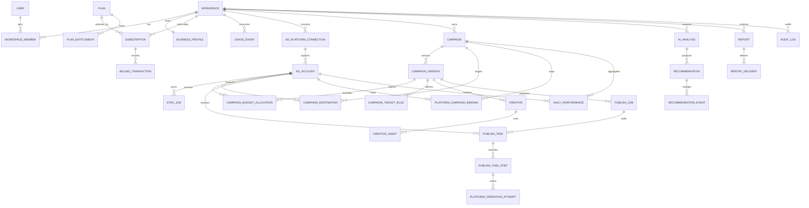

# GrowdoAds 데이터베이스 스키마 v1

> 상태: 백엔드 구현 기준  
> DB: PostgreSQL + TypeORM  
> 범위: 인증, 워크스페이스, 결제, 광고계정, 공통 캠페인, 게시, 성과, AI, 리포트

## 1. 설계 원칙

1. 모든 사업 데이터는 `User`가 아니라 `Workspace`가 소유한다.
2. 로그인용 OAuth와 광고 플랫폼 연동 OAuth를 분리한다.
3. 캠페인 초안과 게시된 설정을 같은 행에서 계속 덮어쓰지 않는다.
4. 사용자가 승인한 불변 캠페인 버전을 기준으로 플랫폼 게시 작업을 생성한다.
5. 여러 플랫폼 게시 결과를 작업별로 분리해 부분 성공과 재시도를 지원한다.
6. 광고비와 SaaS 구독료는 서로 다른 원장에 저장한다.
7. CTR·CPA·ROAS 등 파생 지표는 원시 지표에서 계산하고 중복 저장하지 않는다.
8. 외부 API 작업은 반드시 멱등 키와 외부 ID를 가진다.
9. 토큰과 민감정보는 암호화하며 API 원문을 일반 로그에 남기지 않는다.
10. 운영 데이터 삭제는 물리 삭제보다 상태 변경과 보존 정책을 우선한다.
11. 내부 기본키는 `BIGINT AUTO INCREMENT`, 내부 외래키는 `BIGINT`로 통일한다.
12. OAuth 제공자 ID, 광고 플랫폼 ID, 결제 제공자 ID는 원본 형식을 보존해 `varchar`로 저장한다.

## 2. 현재 스키마에서 유지할 항목

### `users`

현재 구조를 유지하되 다음 필드를 추가한다.

| 필드              | 타입                     | 설명                                |
| ----------------- | ------------------------ | ----------------------------------- |
| id                | bigint auto increment PK | 사용자 ID                           |
| email             | citext 또는 varchar      | 로그인 이메일, 대소문자 무시 유일값 |
| password_hash     | varchar nullable         | 로컬 로그인 비밀번호 해시           |
| display_name      | varchar nullable         | 표시 이름                           |
| status            | enum                     | active, suspended, deleted          |
| email_verified_at | timestamptz nullable     | 이메일 인증 시각                    |
| created_at        | timestamptz              | 생성 시각                           |
| updated_at        | timestamptz              | 수정 시각                           |
| deleted_at        | timestamptz nullable     | 탈퇴·삭제 시각                      |

### `oauth_accounts`

로그인 제공자용 테이블로만 사용한다. 광고계정 API 토큰을 이 테이블에 저장하지 않는다.

현재 유일 제약 `UNIQUE(provider, provider_id)`를 유지한다.

### Redis 세션

Access·Refresh 세션은 현재처럼 Redis에 저장한다. PostgreSQL에는 세션 원문을 중복 저장하지 않는다.

## 3. 전체 관계

### 요구사항 명칭 대응표

기획 단계의 기능명과 실제 구현 테이블은 다음처럼 대응한다. 초안·게시·오류를 단일 테이블로 뭉치지 않고 버전과 실행 단위로 분리했다.

| 요구사항 명칭              | 구현 테이블                                         | 설계 이유                                                |
| -------------------------- | --------------------------------------------------- | -------------------------------------------------------- |
| campaign_drafts            | campaigns + campaign_versions                       | 캠페인 정체성과 편집 버전을 분리하고 `draft` 상태로 관리 |
| campaign_targets           | campaign_target_rules + campaign_versions.targeting | 편집 가능한 규칙과 승인 시점의 불변 스냅샷 분리          |
| campaign_budgets           | campaign_versions + campaign_budget_allocations     | 공통 기본 예산과 광고계정별 override 분리                |
| creative_assets            | creatives + creative_assets                         | 광고 구성과 실제 파일 메타데이터 분리                    |
| publish_requests           | publish_jobs                                        | 사용자 승인 1건을 상위 게시 작업으로 관리                |
| platform_campaign_mappings | platform_campaign_bindings                          | 내부 캠페인과 플랫폼 외부 ID 연결                        |
| platform_operation_jobs    | publish_tasks + publish_task_steps                  | 광고계정 작업과 플랫폼 API 실행 단계 분리                |
| platform_operation_errors  | platform_operation_attempts                         | 재시도별 응답·오류를 덮어쓰지 않고 보존                  |
| campaign_change_logs       | campaign_versions + audit_logs                      | 설정 변경 버전과 사용자 행위 감사를 분리                 |

## 4. 워크스페이스·사업정보

### `workspaces`

결제, 광고계정, 캠페인, 성과 데이터의 최상위 소유자다.

| 필드             | 타입                     | 제약·설명                 |
| ---------------- | ------------------------ | ------------------------- |
| id               | bigint auto increment PK |                           |
| name             | varchar(120)             | 사업 또는 팀 이름         |
| slug             | varchar(80)              | UNIQUE, URL 식별자        |
| status           | enum                     | active, suspended, closed |
| default_currency | char(3)                  | ISO 4217, 예: KRW         |
| timezone         | varchar(64)              | IANA, 예: Asia/Seoul      |
| created_by       | bigint FK users          | 최초 생성자               |
| created_at       | timestamptz              |                           |
| updated_at       | timestamptz              |                           |

### `workspace_members`

| 필드         | 타입                     | 제약·설명                      |
| ------------ | ------------------------ | ------------------------------ |
| id           | bigint auto increment PK |                                |
| workspace_id | bigint FK                |                                |
| user_id      | bigint FK                |                                |
| role         | enum                     | owner, admin, marketer, viewer |
| status       | enum                     | invited, active, disabled      |
| joined_at    | timestamptz nullable     |                                |
| created_at   | timestamptz              |                                |

제약: `UNIQUE(workspace_id, user_id)`

### `business_profiles`

워크스페이스당 하나의 기본 사업 프로필을 둔다.

| 필드              | 타입                     | 설명                                |
| ----------------- | ------------------------ | ----------------------------------- |
| id                | bigint auto increment PK |                                     |
| workspace_id      | bigint FK                | UNIQUE, 워크스페이스당 하나         |
| business_name     | varchar(160)             |                                     |
| industry_code     | varchar(80) nullable     |                                     |
| website_url       | text nullable            |                                     |
| product_summary   | text nullable            |                                     |
| target_customer   | text nullable            |                                     |
| primary_goal      | enum nullable            | sales, leads, traffic, awareness    |
| target_cpa        | numeric(20,6) nullable   |                                     |
| target_roas       | numeric(12,6) nullable   | 4.0은 400%를 의미                   |
| onboarding_status | enum                     | not_started, in_progress, completed |
| updated_at        | timestamptz              |                                     |

## 5. 구독·결제·사용량

### `plans`

| 필드             | 타입                     | 설명                |
| ---------------- | ------------------------ | ------------------- |
| id               | bigint auto increment PK |                     |
| code             | varchar(50)              | starter, pro 등     |
| name             | varchar(80)              | 표시명              |
| billing_interval | enum                     | month, year         |
| price_amount     | numeric(20,6)            | SaaS 구독료         |
| currency         | char(3)                  |                     |
| is_active        | boolean                  | 신규 판매 여부      |
| version          | integer                  | 가격·한도 변경 버전 |

제약: `UNIQUE(code, version)`. 신규 가입에 노출할 현재 버전은 `is_active`와 별도 정책으로 하나만 유지한다.

### `plan_entitlements`

플랜별 제한을 코드 컬럼으로 고정하지 않고 자원별로 관리한다.

| 필드           | 타입                     | 설명                                                   |
| -------------- | ------------------------ | ------------------------------------------------------ |
| id             | bigint auto increment PK |                                                        |
| plan_id        | bigint FK                |                                                        |
| resource       | enum                     | workspace_members, ad_accounts, ai_requests, ai_tokens |
| limit_value    | bigint nullable          | NULL이면 무제한                                        |
| reset_interval | enum nullable            | month, billing_period, none                            |

제약: `UNIQUE(plan_id, resource)`

### `subscriptions`

| 필드                     | 타입                     | 설명                                          |
| ------------------------ | ------------------------ | --------------------------------------------- |
| id                       | bigint auto increment PK |                                               |
| workspace_id             | bigint FK                |                                               |
| plan_id                  | bigint FK                | 가입 시점의 플랜 버전 참조                    |
| provider                 | enum                     | 사용할 결제 제공자                            |
| provider_customer_id     | varchar nullable         | 외부 고객 ID                                  |
| provider_subscription_id | varchar nullable         | 외부 구독 ID, UNIQUE                          |
| status                   | enum                     | trialing, active, past_due, canceled, expired |
| current_period_start     | timestamptz              |                                               |
| current_period_end       | timestamptz              |                                               |
| cancel_at_period_end     | boolean                  |                                               |
| canceled_at              | timestamptz nullable     |                                               |
| created_at               | timestamptz              |                                               |
| updated_at               | timestamptz              |                                               |

동시에 활성화할 수 있는 구독은 워크스페이스당 하나로 제한한다. PostgreSQL 부분 유일 인덱스를 사용한다.

### `billing_transactions`

SaaS 구독료의 결제·취소·환불 원장이다. 광고 플랫폼 광고비는 저장하지 않는다.

| 필드                    | 타입                     | 설명                                 |
| ----------------------- | ------------------------ | ------------------------------------ |
| id                      | bigint auto increment PK |                                      |
| workspace_id            | bigint FK                |                                      |
| subscription_id         | bigint FK nullable       |                                      |
| type                    | enum                     | charge, refund, adjustment           |
| status                  | enum                     | pending, succeeded, failed, canceled |
| amount                  | numeric(20,6)            | 환불도 양수로 저장하고 type으로 구분 |
| currency                | char(3)                  |                                      |
| provider_transaction_id | varchar UNIQUE           |                                      |
| related_transaction_id  | bigint FK nullable       | 환불 대상 결제                       |
| failure_code            | varchar nullable         |                                      |
| failure_message         | text nullable            | 사용자 노출 문구와 분리              |
| occurred_at             | timestamptz              |                                      |
| metadata                | jsonb                    | 세금·영수증 등 비핵심 확장값         |

### `billing_webhook_events`

결제 제공자의 웹훅을 중복 없이 처리하고 장애 후 재처리하기 위한 수신 원장이다.

| 필드              | 타입                     | 설명                                 |
| ----------------- | ------------------------ | ------------------------------------ |
| id                | bigint auto increment PK |                                      |
| provider          | enum                     |                                      |
| provider_event_id | varchar                  | 제공자 이벤트 ID                     |
| event_type        | varchar                  | 제공자 원문 유형                     |
| payload           | jsonb                    | 민감정보를 제거하거나 암호화한 원문  |
| status            | enum                     | received, processed, failed, ignored |
| attempt_count     | integer                  |                                      |
| processed_at      | timestamptz nullable     |                                      |
| created_at        | timestamptz              |                                      |

제약: `UNIQUE(provider, provider_event_id)`

### `usage_events`

| 필드            | 타입                     | 설명                                           |
| --------------- | ------------------------ | ---------------------------------------------- |
| id              | bigint auto increment PK |                                                |
| workspace_id    | bigint FK                |                                                |
| resource        | enum                     | ai_requests, ai_input_tokens, ai_output_tokens |
| quantity        | bigint                   | 증가·보정값                                    |
| idempotency_key | varchar UNIQUE           | 중복 과금·차감 방지                            |
| reference_type  | varchar                  | ai_analysis, ad_account 등                     |
| reference_id    | bigint nullable          |                                                |
| occurred_at     | timestamptz              |                                                |

AI처럼 기간별 누적이 필요한 사용량은 원장에서 집계하되, 성능이 필요하면 `usage_counters`를 별도 캐시 테이블로 추가한다. 현재 사용자 수와 광고계정 수는 각각 `workspace_members`, `ad_accounts`의 활성 행을 트랜잭션 안에서 계산해 제한한다.

## 6. 광고 플랫폼 연결

### `ad_platform_connections`

로그인 OAuth와 별개인 광고 API 인증 연결이다.

| 필드                     | 타입                     | 설명                                    |
| ------------------------ | ------------------------ | --------------------------------------- |
| id                       | bigint auto increment PK |                                         |
| workspace_id             | bigint FK                |                                         |
| platform                 | enum                     | google_ads, meta_ads, naver_ads         |
| external_user_id         | varchar nullable         | 플랫폼 인증 주체                        |
| status                   | enum                     | active, reauth_required, revoked, error |
| access_token_ciphertext  | text                     | 애플리케이션 암호화                     |
| refresh_token_ciphertext | text nullable            |                                         |
| token_expires_at         | timestamptz nullable     |                                         |
| scopes                   | text[]                   | 승인 범위                               |
| last_error_code          | varchar nullable         |                                         |
| created_by               | bigint FK users          |                                         |
| created_at               | timestamptz              |                                         |
| updated_at               | timestamptz              |                                         |

### `ad_accounts`

| 필드                | 타입                     | 설명                           |
| ------------------- | ------------------------ | ------------------------------ |
| id                  | bigint auto increment PK | 내부 ID                        |
| workspace_id        | bigint FK                | 조회·격리 성능을 위해 명시     |
| connection_id       | bigint FK                |                                |
| platform            | enum                     | 연결과 일치해야 함             |
| external_account_id | varchar                  | 플랫폼 광고계정 ID             |
| name                | varchar(160)             |                                |
| currency            | char(3)                  | 광고비 통화                    |
| timezone            | varchar(64)              | 광고계정 시간대                |
| status              | enum                     | active, disabled, disconnected |
| last_synced_at      | timestamptz nullable     |                                |

제약: `UNIQUE(workspace_id, platform, external_account_id)`. 같은 외부 광고계정을 여러 워크스페이스가 공유할 수 있는지는 별도 사업 정책으로 제한한다.

### `sync_jobs`

| 필드            | 타입                     | 설명                                        |
| --------------- | ------------------------ | ------------------------------------------- |
| id              | bigint auto increment PK |                                             |
| workspace_id    | bigint FK                |                                             |
| ad_account_id   | bigint FK                |                                             |
| job_type        | enum                     | initial, scheduled, manual, backfill        |
| date_from       | date nullable            |                                             |
| date_to         | date nullable            |                                             |
| status          | enum                     | queued, running, partial, succeeded, failed |
| attempt_count   | integer                  |                                             |
| idempotency_key | varchar UNIQUE           |                                             |
| error_code      | varchar nullable         |                                             |
| error_detail    | jsonb nullable           | 민감정보 제거 후 저장                       |
| started_at      | timestamptz nullable     |                                             |
| finished_at     | timestamptz nullable     |                                             |

## 7. 공통 캠페인

### `campaigns`

캠페인의 정체성과 현재 상태만 저장한다. 편집 가능한 설정은 버전 테이블에 둔다.

| 필드               | 타입                     | 설명                                                           |
| ------------------ | ------------------------ | -------------------------------------------------------------- |
| id                 | bigint auto increment PK |                                                                |
| workspace_id       | bigint FK                |                                                                |
| name               | varchar(160)             | 서비스 내 이름                                                 |
| objective          | enum                     | sales, leads, traffic, awareness                               |
| lifecycle_status   | enum                     | draft, pending_approval, active, paused, ended, partial, error |
| current_version_id | bigint FK nullable       | 현재 승인·게시 기준 버전                                       |
| created_by         | bigint FK users          |                                                                |
| created_at         | timestamptz              |                                                                |
| updated_at         | timestamptz              |                                                                |
| archived_at        | timestamptz nullable     |                                                                |

### `campaign_versions`

초안 저장과 감사 추적을 위해 버전을 불변에 가깝게 관리한다. 승인 이후에는 수정하지 않고 새 버전을 만든다.

| 필드               | 타입                     | 설명                                   |
| ------------------ | ------------------------ | -------------------------------------- |
| id                 | bigint auto increment PK |                                        |
| campaign_id        | bigint FK                |                                        |
| version_no         | integer                  | 캠페인별 순번                          |
| status             | enum                     | draft, validated, approved, superseded |
| budget_type        | enum                     | daily, lifetime                        |
| budget_amount      | numeric(20,6)            | 광고비 예산                            |
| currency           | char(3)                  |                                        |
| starts_at          | timestamptz              |                                        |
| ends_at            | timestamptz nullable     |                                        |
| bid_strategy       | jsonb                    | 공통 입찰 구조, 서비스 스키마 검증     |
| targeting          | jsonb                    | 공통 타기팅 구조, 서비스 스키마 검증   |
| landing_url        | text nullable            |                                        |
| platform_overrides | jsonb                    | 플랫폼 고유 옵션만 저장                |
| created_by         | bigint FK users          |                                        |
| approved_by        | bigint FK users nullable |                                        |
| approved_at        | timestamptz nullable     |                                        |
| created_at         | timestamptz              |                                        |

제약: `UNIQUE(campaign_id, version_no)`

공통 필드 전체를 JSONB 하나에 넣지 않는다. 예산·기간·목표처럼 조회와 정책 판단에 쓰이는 값은 정규 컬럼으로 유지하고, 변화가 잦은 입찰·타기팅과 플랫폼 고유값만 JSONB로 둔다.

- `budget_type`, `budget_amount`, `currency`, `bid_strategy`는 캠페인 전체의 기본값이다.
- 세부 타기팅의 원본은 `campaign_target_rules`이며, `targeting`은 검증·승인 시 생성하는 불변 통합 스냅샷이다.
- 광고계정별 예산·입찰값이 다르면 `campaign_budget_allocations`가 기본값보다 우선한다.
- 서비스는 승인 전에 규칙과 할당값을 `targeting`, `preview_snapshot`으로 변환하고 플랫폼별 유효성을 검증한다.

### `campaign_budget_allocations`

하나의 캠페인 버전을 여러 광고계정에 게시할 때 광고계정별 예산과 입찰 설정을 덮어쓴다. 행이 없으면 `campaign_versions`의 공통 기본값을 사용한다.

| 필드                | 타입                     | 설명                                     |
| ------------------- | ------------------------ | ---------------------------------------- |
| id                  | bigint auto increment PK |                                          |
| campaign_version_id | bigint FK                | 대상 불변 버전, 삭제 시 함께 삭제        |
| ad_account_id       | bigint FK                | 예산을 적용할 광고계정, 삭제 제한        |
| budget_type         | enum                     | daily, lifetime                          |
| budget_amount       | numeric(20,6)            | 해당 광고계정에 적용할 광고비 예산       |
| currency            | char(3)                  | ISO 4217 통화                            |
| bid_strategy        | jsonb                    | 공통 형식의 입찰 전략과 플랫폼별 추가 값 |
| created_at          | timestamptz              |                                          |

제약: `UNIQUE(campaign_version_id, ad_account_id)`. 같은 캠페인의 게시 대상인지와 광고계정 통화가 일치하는지는 서비스 계층에서 검증한다.

### `campaign_target_rules`

조회·검증 가능한 최소 단위로 타기팅 조건을 저장한다. `platform IS NULL`이면 공통 규칙이고, 값이 있으면 해당 플랫폼 전용 규칙이다.

| 필드                | 타입                     | 설명                                                                  |
| ------------------- | ------------------------ | --------------------------------------------------------------------- |
| id                  | bigint auto increment PK |                                                                       |
| campaign_version_id | bigint FK                | 대상 불변 버전, 삭제 시 함께 삭제                                     |
| platform            | enum nullable            | google_ads, meta_ads, naver_ads; NULL은 공통                          |
| target_type         | enum                     | location, age, gender, interest, keyword, audience, device, placement |
| operator            | enum                     | include, exclude                                                      |
| value               | jsonb                    | 서비스 공통 형식의 값                                                 |
| platform_value      | jsonb nullable           | 외부 ID 등 플랫폼 전용 변환 결과                                      |
| sort_order          | integer                  | 같은 유형 안의 표시·처리 순서                                         |
| created_at          | timestamptz              |                                                                       |

인덱스: `(campaign_version_id, platform, target_type)`. 초안에서는 이 행들을 편집하고, 승인 시 통합한 결과를 `campaign_versions.targeting`에 스냅샷으로 고정한다.

### `campaign_destinations`

하나의 공통 캠페인을 어느 광고계정에 게시할지 정의한다.

| 필드          | 타입                     | 설명 |
| ------------- | ------------------------ | ---- |
| id            | bigint auto increment PK |      |
| campaign_id   | bigint FK                |      |
| ad_account_id | bigint FK                |      |
| enabled       | boolean                  |      |
| created_at    | timestamptz              |      |

제약: `UNIQUE(campaign_id, ad_account_id)`

### `creatives`

| 필드                | 타입                     | 설명                           |
| ------------------- | ------------------------ | ------------------------------ |
| id                  | bigint auto increment PK |                                |
| campaign_version_id | bigint FK                | 특정 버전에 고정               |
| type                | enum                     | text, image, video, responsive |
| name                | varchar(160)             |                                |
| headline            | text nullable            |                                |
| body                | text nullable            |                                |
| call_to_action      | varchar nullable         |                                |
| destination_url     | text nullable            |                                |
| sort_order          | integer                  |                                |

### `creative_assets`

| 필드              | 타입                     | 설명                           |
| ----------------- | ------------------------ | ------------------------------ |
| id                | bigint auto increment PK |                                |
| creative_id       | bigint FK                |                                |
| asset_type        | enum                     | image, video, logo             |
| storage_key       | text                     | 공개 URL 대신 내부 스토리지 키 |
| mime_type         | varchar                  |                                |
| size_bytes        | bigint                   |                                |
| width             | integer nullable         |                                |
| height            | integer nullable         |                                |
| checksum          | varchar                  | 파일 중복·무결성 확인          |
| validation_status | enum                     | pending, valid, invalid        |
| validation_errors | jsonb nullable           | 플랫폼별 오류                  |

## 8. 승인·플랫폼 게시

### `publish_jobs`

사용자 승인 한 번에 대응하는 상위 작업이다.

| 필드                | 타입                     | 설명                                                           |
| ------------------- | ------------------------ | -------------------------------------------------------------- |
| id                  | bigint auto increment PK |                                                                |
| workspace_id        | bigint FK                |                                                                |
| campaign_id         | bigint FK                |                                                                |
| campaign_version_id | bigint FK                | 승인한 불변 버전                                               |
| action              | enum                     | create, update, pause, resume                                  |
| status              | enum                     | awaiting_approval, queued, running, partial, succeeded, failed |
| preview_snapshot    | jsonb                    | 사용자에게 보여준 최종 변환 결과                               |
| preview_hash        | varchar(128)             | 승인 대상 스냅샷의 무결성 해시                                 |
| requested_by        | bigint FK users          |                                                                |
| approved_by         | bigint FK users nullable |                                                                |
| approved_at         | timestamptz nullable     |                                                                |
| idempotency_key     | varchar UNIQUE           |                                                                |
| created_at          | timestamptz              |                                                                |
| finished_at         | timestamptz nullable     |                                                                |

승인은 `campaign_version_id`와 `preview_snapshot`의 해시에 묶는다. 승인 뒤 초안이 변경되면 기존 승인은 무효다.

### `publish_tasks`

플랫폼·광고계정별 실제 API 작업이다. 부분 실패의 최소 단위다.

| 필드                | 타입                     | 설명                                         |
| ------------------- | ------------------------ | -------------------------------------------- |
| id                  | bigint auto increment PK |                                              |
| publish_job_id      | bigint FK                |                                              |
| ad_account_id       | bigint FK                |                                              |
| platform            | enum                     |                                              |
| status              | enum                     | queued, running, succeeded, failed, canceled |
| request_payload     | jsonb                    | 민감값 제거한 실제 요청 스냅샷               |
| response_snapshot   | jsonb nullable           | 필요한 외부 ID·상태만 저장                   |
| attempt_count       | integer                  |                                              |
| error_code          | varchar nullable         |                                              |
| error_message       | text nullable            |                                              |
| external_request_id | varchar nullable         | 플랫폼 추적 ID                               |
| started_at          | timestamptz nullable     |                                              |
| finished_at         | timestamptz nullable     |                                              |

제약: `UNIQUE(publish_job_id, ad_account_id)`

### `publish_task_steps`

한 플랫폼 안의 캠페인·광고그룹·소재·광고 생성 단계를 분리한다. 앞 단계 성공 후 뒤 단계가 실패한 경우 성공한 외부 자원을 중복 생성하지 않고 실패 지점부터 재시도한다.

| 필드               | 타입                     | 설명                                        |
| ------------------ | ------------------------ | ------------------------------------------- |
| id                 | bigint auto increment PK |                                             |
| publish_task_id    | bigint FK                |                                             |
| step_order         | integer                  | 실행 순서                                   |
| entity_type        | enum                     | campaign, group, creative, ad               |
| operation          | enum                     | create, update, pause, resume               |
| local_entity_id    | bigint nullable          | creative 등 내부 대상                       |
| external_entity_id | varchar nullable         | 성공한 외부 자원 ID                         |
| status             | enum                     | queued, running, succeeded, failed, skipped |
| request_payload    | jsonb                    | 민감정보 제거 요청 스냅샷                   |
| response_snapshot  | jsonb nullable           | 필요한 결과만 저장                          |
| error_code         | varchar nullable         |                                             |
| error_message      | text nullable            |                                             |
| attempt_count      | integer                  |                                             |
| started_at         | timestamptz nullable     |                                             |
| finished_at        | timestamptz nullable     |                                             |

제약: `UNIQUE(publish_task_id, step_order)`

### `platform_operation_attempts`

플랫폼 API 단계의 매 실행 시도를 append-only로 기록한다. `publish_task_steps`에는 현재 집계 상태를 두고, 이 테이블에는 재시도마다 달라진 요청·응답·오류를 보존한다.

| 필드                 | 타입                     | 설명                                 |
| -------------------- | ------------------------ | ------------------------------------ |
| id                   | bigint auto increment PK |                                      |
| publish_task_step_id | bigint FK                | 실행 단계, 삭제 시 함께 삭제         |
| attempt_no           | integer                  | 단계 안의 1부터 시작하는 재시도 순번 |
| status               | enum                     | running, succeeded, failed           |
| request_snapshot     | jsonb                    | 민감정보를 제거한 실제 요청          |
| response_snapshot    | jsonb nullable           | 필요한 외부 결과만 저장              |
| external_request_id  | varchar nullable         | 플랫폼 요청 추적 ID                  |
| error_code           | varchar nullable         | 정규화 또는 플랫폼 오류 코드         |
| error_message        | text nullable            | 민감정보를 제거한 오류 메시지        |
| started_at           | timestamptz              |                                      |
| finished_at          | timestamptz nullable     |                                      |

제약: `UNIQUE(publish_task_step_id, attempt_no)`. 재시도 시 기존 행을 덮어쓰지 않고 다음 `attempt_no`를 추가한다.

### `platform_campaign_bindings`

공통 캠페인과 플랫폼 실제 캠페인의 매핑 및 마지막 확인 상태다.

| 필드                    | 타입                     | 설명                                  |
| ----------------------- | ------------------------ | ------------------------------------- |
| id                      | bigint auto increment PK |                                       |
| campaign_id             | bigint FK                |                                       |
| ad_account_id           | bigint FK                |                                       |
| platform                | enum                     |                                       |
| external_campaign_id    | varchar                  |                                       |
| external_group_ids      | jsonb nullable           | ad set, ad group 등 플랫폼별 하위 ID  |
| external_ad_ids         | jsonb nullable           |                                       |
| remote_status           | varchar                  | 플랫폼 원문 상태                      |
| normalized_status       | enum                     | active, paused, ended, error, unknown |
| last_applied_version_id | bigint FK                | 마지막 성공 버전                      |
| last_remote_snapshot    | jsonb nullable           | 드리프트 비교용                       |
| last_synced_at          | timestamptz              |                                       |

제약: `UNIQUE(ad_account_id, external_campaign_id)` 및 `UNIQUE(campaign_id, ad_account_id)`

## 9. 성과 데이터

### `daily_performance`

한 행의 기본 grain은 `광고계정 × 플랫폼 캠페인 × 날짜 × 통화`다.

| 필드                 | 타입                     | 설명                                  |
| -------------------- | ------------------------ | ------------------------------------- |
| id                   | bigint auto increment PK | 순차 적재와 인덱스 효율을 고려        |
| workspace_id         | bigint FK                | 테넌트 격리와 조회 성능               |
| ad_account_id        | bigint FK                |                                       |
| campaign_id          | bigint FK nullable       | 서비스에서 만든 캠페인이 아닐 수 있음 |
| platform_binding_id  | bigint FK nullable       |                                       |
| external_campaign_id | varchar                  | 외부에서만 만든 캠페인도 식별         |
| report_date          | date                     | 광고계정 시간대 기준                  |
| currency             | char(3)                  |                                       |
| impressions          | bigint                   | 원시 지표                             |
| clicks               | bigint                   | 원시 지표                             |
| conversions          | numeric(20,6)            | 부분 전환 지원                        |
| spend                | numeric(20,6)            | 광고 플랫폼 집행비                    |
| conversion_value     | numeric(20,6)            | 매출·전환 가치                        |
| source_updated_at    | timestamptz nullable     | 플랫폼 원본 수정 시각                 |
| synced_at            | timestamptz              |                                       |

제약: `UNIQUE(ad_account_id, external_campaign_id, report_date, currency)`

주요 인덱스:

- `(workspace_id, report_date DESC)`
- `(workspace_id, campaign_id, report_date DESC)`
- `(ad_account_id, report_date DESC)`

CTR, CVR, CPA, ROAS는 조회 계층에서 다음 원시 합계로 계산한다. 일별 계산값을 다시 평균하지 않는다.

- CTR = `SUM(clicks) / SUM(impressions)`
- CVR = `SUM(conversions) / SUM(clicks)`
- CPA = `SUM(spend) / SUM(conversions)`
- ROAS = `SUM(conversion_value) / SUM(spend)`

## 10. AI·추천 행동

### `ai_analyses`

| 필드               | 타입                     | 설명                                         |
| ------------------ | ------------------------ | -------------------------------------------- |
| id                 | bigint auto increment PK |                                              |
| workspace_id       | bigint FK                |                                              |
| scope_type         | enum                     | workspace, ad_account, campaign              |
| scope_id           | bigint nullable          |                                              |
| period_start       | date                     |                                              |
| period_end         | date                     |                                              |
| comparison_start   | date nullable            |                                              |
| comparison_end     | date nullable            |                                              |
| input_metrics      | jsonb                    | 코드로 검증한 수치 스냅샷                    |
| detected_anomalies | jsonb                    | 코드 기반 탐지 결과                          |
| model_provider     | varchar                  |                                              |
| model_name         | varchar                  |                                              |
| prompt_version     | varchar                  |                                              |
| status             | enum                     | queued, succeeded, failed, insufficient_data |
| summary            | text nullable            |                                              |
| limitations        | jsonb nullable           | 데이터 부족·주의사항                         |
| input_tokens       | integer nullable         |                                              |
| output_tokens      | integer nullable         |                                              |
| created_at         | timestamptz              |                                              |

### `recommendations`

| 필드        | 타입                     | 설명                                                                                 |
| ----------- | ------------------------ | ------------------------------------------------------------------------------------ |
| id          | bigint auto increment PK |                                                                                      |
| analysis_id | bigint FK                |                                                                                      |
| campaign_id | bigint FK nullable       |                                                                                      |
| action_type | enum                     | maintain, pause, increase_budget, decrease_budget, review_targeting, review_creative |
| title       | varchar(200)             |                                                                                      |
| rationale   | text                     |                                                                                      |
| evidence    | jsonb                    | 지표·기간·비교값                                                                     |
| confidence  | enum                     | low, medium, high                                                                    |
| status      | enum                     | proposed, executing, deferred, completed, dismissed                                  |
| created_at  | timestamptz              |                                                                                      |

### `recommendation_events`

추천 상태 변경과 사용자 메모를 append-only로 기록한다.

| 필드              | 타입                     | 설명                                            |
| ----------------- | ------------------------ | ----------------------------------------------- |
| id                | bigint auto increment PK |                                                 |
| recommendation_id | bigint FK                |                                                 |
| event_type        | enum                     | status_changed, note_added, campaign_job_linked |
| from_status       | enum nullable            |                                                 |
| to_status         | enum nullable            |                                                 |
| note              | text nullable            |                                                 |
| actor_user_id     | bigint FK                |                                                 |
| created_at        | timestamptz              |                                                 |

## 11. 리포트·감사

### `reports`

| 필드             | 타입                     | 설명                      |
| ---------------- | ------------------------ | ------------------------- |
| id               | bigint auto increment PK |                           |
| workspace_id     | bigint FK                |                           |
| type             | enum                     | weekly, monthly, custom   |
| period_start     | date                     |                           |
| period_end       | date                     |                           |
| metrics_snapshot | jsonb                    | 생성 당시 확정 수치       |
| content          | jsonb                    | 섹션별 구조화 결과        |
| status           | enum                     | generating, ready, failed |
| generated_at     | timestamptz nullable     |                           |

제약: `UNIQUE(workspace_id, type, period_start, period_end)`

### `report_deliveries`

| 필드                | 타입                     | 설명                            |
| ------------------- | ------------------------ | ------------------------------- |
| id                  | bigint auto increment PK |                                 |
| report_id           | bigint FK                |                                 |
| channel             | enum                     | email                           |
| recipient           | varchar                  |                                 |
| status              | enum                     | queued, sent, delivered, failed |
| provider_message_id | varchar nullable         |                                 |
| attempt_count       | integer                  |                                 |
| sent_at             | timestamptz nullable     |                                 |
| error_code          | varchar nullable         |                                 |

제약: `UNIQUE(report_id, channel, recipient)`

### `audit_logs`

중요한 관리·결제·캠페인 변경을 append-only로 저장한다.

| 필드          | 타입                     | 설명                 |
| ------------- | ------------------------ | -------------------- |
| id            | bigint auto increment PK |                      |
| workspace_id  | bigint FK                |                      |
| actor_user_id | bigint FK nullable       | 시스템 작업이면 NULL |
| actor_type    | enum                     | user, system, admin  |
| action        | varchar(100)             | campaign.approved 등 |
| entity_type   | varchar(80)              |                      |
| entity_id     | bigint nullable          |                      |
| before_value  | jsonb nullable           | 민감정보 제외        |
| after_value   | jsonb nullable           | 민감정보 제외        |
| request_id    | varchar nullable         | 로그 추적 ID         |
| ip_address    | inet nullable            | 보존 정책 필요       |
| created_at    | timestamptz              |                      |

감사 로그는 일반 애플리케이션 삭제 경로에서 삭제하지 않는다.

## 12. 상태와 enum 정책

DB enum을 모든 상태에 사용하면 변경 migration 부담이 커질 수 있다. 다음처럼 구분한다.

- 변경 가능성이 낮고 제약이 중요한 값: PostgreSQL enum 또는 check constraint
- 외부 플랫폼 원문 상태: varchar로 보관
- 화면용 통합 상태: 애플리케이션 enum + check constraint
- 결제 제공자 이벤트 원문: 별도 원문 컬럼 또는 jsonb

`platform`, `role`, `billing_interval`, `publish action`은 강한 enum 후보이고, 외부 광고 상태와 오류 코드는 varchar가 적합하다.

## 13. 삭제·보존 정책

- `users`: 탈퇴 시 soft delete 및 개인정보 익명화
- `workspaces`: 즉시 물리 삭제하지 않고 closed 상태 전환
- 광고 플랫폼 토큰: 연결 해제 즉시 폐기 또는 암호문 제거
- 캠페인 버전·게시 작업·감사 로그: 운영·분쟁 대응 기간 동안 보존
- 결제 거래: 관련 법무·회계 정책에 따른 별도 보존 기간 적용
- 성과 원본: 계약과 비용에 따라 보존 기간 결정 후 파티션 단위 삭제
- AI 입력: 토큰·개인정보를 제거하고 보존 기간을 짧게 설정

## 14. 마이그레이션 권장 순서

### Migration 1 — 테넌트 기반

- 기존 `users`, `oauth_accounts` 보완
- `workspaces`
- `workspace_members`
- `business_profiles`
- 기존 사용자별 기본 워크스페이스 생성

### Migration 2 — 구독·권한

- `plans`
- `plan_entitlements`
- `subscriptions`
- `billing_transactions`
- `billing_webhook_events`
- `usage_events`

### Migration 3 — 광고계정·성과 수집

- `ad_platform_connections`
- `ad_accounts`
- `sync_jobs`
- `daily_performance`

### Migration 4 — 캠페인·게시

- `campaigns`
- `campaign_versions`
- `campaign_budget_allocations`
- `campaign_target_rules`
- `campaign_destinations`
- `creatives`
- `creative_assets`
- `publish_jobs`
- `publish_tasks`
- `publish_task_steps`
- `platform_operation_attempts`
- `platform_campaign_bindings`

### Migration 5 — AI·리포트·감사

- `ai_analyses`
- `recommendations`
- `recommendation_events`
- `reports`
- `report_deliveries`
- `audit_logs`

## 15. 구현 전 반드시 결정할 항목

1. 개인 계정도 항상 1인 워크스페이스로 만들지 여부
2. 첫 결제 제공자와 국내 카드·현금영수증·세금계산서 범위
3. 환불, 업·다운그레이드, 일할 계산 정책
4. 세 플랫폼에서 MVP로 지원할 캠페인 유형
5. 하나의 공통 캠페인을 여러 플랫폼에 동시에 게시할지 여부
6. Google·Meta·네이버의 서로 다른 캠페인 계층을 어디까지 공통화할지
7. 예산 통화가 다른 광고계정을 하나의 캠페인에 포함할 수 있는지
8. 전환·매출 지표의 출처와 attribution 기준
9. 성과 데이터 보관 기간과 원본 API 응답 보관 방식
10. 캠페인 게시 실패 시 자동 롤백 또는 사용자 선택 재시도 정책
